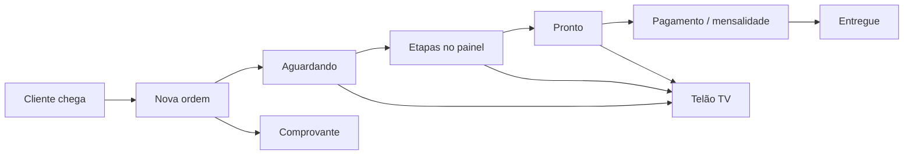

<p align="center">
  
</p>

<h1 align="center">GoMotors</h1>

<p align="center">
  Sistema de gestão para <strong>lava-rápido</strong> — operação, caixa, telão e relatórios.<br/>
  Desenvolvido para a <strong>Go Motors</strong> (Matheus Poli).
</p>

<p align="center">
  <a href="https://go-motors-ten.vercel.app"><strong>Produção</strong></a> ·
  <a href="https://go-motors-ten.vercel.app/display">Telão TV</a> ·
  <a href="./WORKFLOW.md">Fluxo dev/main</a> ·
  <a href="./ENTREGA.md">Checklist entrega</a> ·
  <a href="./DEPLOY.md">Deploy</a>
</p>

<p align="center">
  
  
  
  
</p>

---

## ⚠️ Antes de alterar qualquer código

> **O Matheus usa a branch `main`. Você desenvolve na `dev`.**

```bash
git branch --show-current   # deve ser: dev
git checkout dev            # se não estiver
```

| Branch | Uso | URL |
|--------|-----|-----|
| **`main`** | Produção — lava-rápido em operação | https://go-motors-ten.vercel.app |
| **`dev`** | Suas alterações e testes | Preview Vercel após `git push origin dev` |

### Fluxo obrigatório

```text
dev  →  npm run dev (testar local)  →  git push origin dev (preview)  →  npm run promote:prod  →  main
```

| Comando | O que faz |
|---------|-----------|
| `npm run dev` | Servidor local — **avisa** se você estiver na `main` |
| `npm run branch:check` | Mostra alerta de branch |
| `npm run promote:prod` | Publica na produção com checklist |
| `npm test` | Testes automatizados |

**Nunca** faça `git push origin main` direto. Detalhes: **[WORKFLOW.md](./WORKFLOW.md)**

Proteção Git (rodar uma vez por máquina):

```bash
git config core.hooksPath .githooks
```

---

## Produção (Go Motors)

| Uso | URL |
|-----|-----|
| **Sistema** | https://go-motors-ten.vercel.app |
| **Telão (TV)** | https://go-motors-ten.vercel.app/display |

Login com e-mail e senha definidos em **Usuários** (não há senhas padrão públicas).

---

## O que o sistema faz

Sistema web para **um estabelecimento** — não é site de divulgação; é ferramenta interna da equipe.

### Operação (dia a dia)

| Módulo | Descrição |
|--------|-----------|
| **Painel operacional** | Kanban em tempo real por etapa (lavagem, aspiração, extras, finalização, pronto) |
| **Nova ordem** | Entrada de veículo, serviços, desconto, pagamento |
| **Clientes e veículos** | Cadastro, histórico, busca por placa |
| **Comprovante** | Impressão e link WhatsApp |
| **Telão `/display`** | Fila pública na TV (placa + status) |

### Gestão (administrador)

| Módulo | Descrição |
|--------|-----------|
| **Dashboard e financeiro** | Faturamento, despesas, lucro |
| **Caixa** | Fechamento diário e pendências |
| **Mensalidade** | Lançar, liberar carro, quitar no fechamento |
| **Serviços** | Preços por tipo de veículo |
| **Estoque, funcionários, lojas parceiras** | Controle completo |
| **Relatórios e auditoria** | Exportação e histórico de ações |
| **Usuários** | Criar atendentes e administradores |

### Perfis

```
Administrador (PROPRIETARIO)
├── Tudo: caixa, financeiro, relatórios, usuários, estoque

Atendente (ATENDENTE)
├── Painel, nova OS, clientes, ordens, comprovante
└── Sem caixa, relatórios nem configurações
```

---

## Stack

| Camada | Tecnologia |
|--------|------------|
| Frontend | Next.js 16, React 19, Tailwind CSS 4 |
| Backend | API Routes (Next.js) |
| Banco | PostgreSQL (Neon) + Prisma 7 |
| Auth | JWT em cookie httpOnly + bcrypt |
| Hospedagem | Vercel (CI/CD na `main`) |
| Testes | Node test runner + GitHub Actions |

---

## Rodar no seu PC

### Pré-requisitos

- Node.js 20+
- Git
- Arquivo `.env` (copiar de `.env.example`)

### Setup

```bash
git clone https://github.com/Yuritborges/GoMotors.git
cd GoMotors
git checkout dev

npm install
cp .env.example .env
# Edite .env: DATABASE_URL, DIRECT_URL, AUTH_SECRET (mesmos da Vercel/Neon)

npm run db:migrate:deploy
npm run dev
```

Acesse http://localhost:3000

> Use o **mesmo Neon** da produção para ver os dados reais, ou um Neon separado para testes.

---

## Scripts

| Comando | Descrição |
|---------|-----------|
| `npm run dev` | Desenvolvimento local (avisa se estiver na `main`) |
| `npm run promote:prod` | Publicar `dev` → `main` com checklist |
| `npm run branch:check` | Verificar branch atual |
| `npm test` | Testes automatizados |
| `npm run build` | Build de produção |
| `npm run db:migrate:deploy` | Aplicar migrations no Neon |
| `npm run db:import` | Importar planilhas de `dados/` |
| `npm run db:sync-employees` | Sincronizar funcionários |
| `npm run db:set-password` | Trocar senha do admin via terminal |
| `npm run db:seed` | **Só ambiente de teste** — apaga tudo |

---

## Estrutura do projeto

```
GoMotors/
├── src/
│   ├── app/
│   │   ├── (dashboard)/     # Páginas autenticadas
│   │   ├── api/             # REST API
│   │   ├── display/         # Telão público
│   │   └── login/
│   ├── components/
│   └── lib/                 # Auth, Prisma, regras de negócio
├── prisma/                  # Schema e migrations
├── scripts/                 # Import, deploy, testes
├── dados/                   # Planilhas do cliente (NÃO vai pro Git)
├── .cursor/rules/           # Regras para agentes IA (dev antes de main)
├── WORKFLOW.md              # Fluxo dev → produção
├── ENTREGA.md               # Checklist de entrega
├── DEPLOY.md                # Neon + Vercel
└── README.md
```

---

## O que NÃO versionar (`.gitignore`)

| Arquivo/pasta | Motivo |
|---------------|--------|
| `.env`, `.env.*` | Secrets (URLs do banco, AUTH_SECRET) |
| `dados/*` | Planilhas com dados do cliente |
| `node_modules/`, `.next/` | Gerados localmente |
| `.vercel/` | Config local da Vercel |

O repositório deve conter **apenas código e documentação**.

---

## Deploy e manutenção

| Ação | Como |
|------|------|
| Publicar alteração | `npm run promote:prod` (após testar na `dev`) |
| Migration nova | `npm run db:migrate:deploy` |
| Rollback de emergência | Vercel → Deployments → Promote to Production |
| Tag estável | `v1.0-entrega` |

Guias: **[DEPLOY.md](./DEPLOY.md)** · **[WORKFLOW.md](./WORKFLOW.md)** · **[ENTREGA.md](./ENTREGA.md)**

---

## Limitações conhecidas

| Item | Situação |
|------|----------|
| Modo offline | Não implementado — requer internet |
| Domínio próprio | Opcional |
| NF fiscal | Não implementado |
| WhatsApp automático | Apenas link manual no comprovante |

---

## Fluxo operacional



---

## Licença

Projeto desenvolvido por **Marlyson Iury Taveira Borges**.  
Uso e customização mediante contrato com o cliente.

---

<p align="center">
  <strong>GoMotors</strong> — Gestão para lava-rápido<br/>
  <a href="https://go-motors-ten.vercel.app">go-motors-ten.vercel.app</a>
</p>
