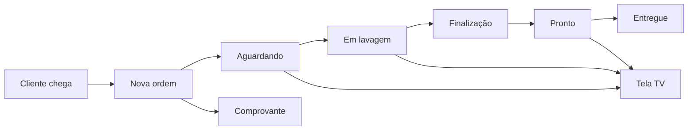

<p align="center">
  
</p>

<h1 align="center">GoMotors</h1>

<p align="center">
  Sistema de gestão completo para <strong>lava-jato</strong> e estética automotiva.<br/>
  Operação no celular, controle no desktop, tela TV para o cliente.
</p>

<p align="center">
  <a href="https://go-motors-ten.vercel.app"><strong>Demo online</strong></a> ·
  <a href="https://go-motors-ten.vercel.app/display">Tela TV</a> ·
  <a href="https://github.com/Yuritborges/GoMotors">GitHub</a> ·
  <a href="./DEPLOY.md">Deploy</a>
</p>

<p align="center">
  
  
  
  
  
  
</p>

---

## Índice

- [Sobre o projeto](#sobre-o-projeto)
- [Por que o GoMotors?](#por-que-o-gomotors)
- [Demo ao vivo](#demo-ao-vivo)
- [Funcionalidades](#funcionalidades)
- [Perfis de acesso](#perfis-de-acesso)
- [Stack tecnológica](#stack-tecnológica)
- [Rodar localmente](#rodar-localmente)
- [Deploy em produção](#deploy-em-produção)
- [Scripts úteis](#scripts-úteis)
- [Estrutura do projeto](#estrutura-do-projeto)
- [Fluxo operacional](#fluxo-operacional)
- [Próximos passos](#próximos-passos-pós-contrato)
- [Licença e uso](#licença-e-uso)

---

## Sobre o projeto

O **GoMotors** nasceu para substituir cadernos, planilhas e controles improvisados em lava-jatos. É um MVP funcional que cobre o fluxo operacional do dia a dia e dá ao dono uma visão gerencial clara do negócio.

Ideal para **apresentação a clientes**, validação com a equipe e **implantação personalizada** com dados reais (clientes, serviços, estoque, funcionários).

---

## Por que o GoMotors?

| Diferencial | Benefício |
|-------------|-----------|
| **Painel Kanban em tempo real** | Toda a equipe vê o status de cada veículo sem gritar ou anotar no papel |
| **Tela TV para clientes** | Experiência profissional — o cliente acompanha a fila como em drive-thru |
| **Mobile-first** | Atendentes registram ordens direto no celular, na hora da entrada |
| **Caixa e relatórios** | Dono fecha o dia com números reais: faturamento, ticket médio, formas de pagamento |
| **Perfis de acesso** | Admin vê tudo; atendente só o que precisa para operar |
| **Pronto para nuvem** | Hospedado na Vercel com banco PostgreSQL (Neon) — acessível de qualquer lugar |

---

## Demo ao vivo

| Ambiente | URL |
|----------|-----|
| **Sistema** | [https://go-motors-ten.vercel.app](https://go-motors-ten.vercel.app) |
| **Tela TV (clientes)** | [https://go-motors-ten.vercel.app/display](https://go-motors-ten.vercel.app/display) |

### Acesso ao sistema

| Ambiente | URL |
|----------|-----|
| **Sistema** | [https://go-motors-ten.vercel.app](https://go-motors-ten.vercel.app) |
| **Tela TV (clientes)** | [https://go-motors-ten.vercel.app/display](https://go-motors-ten.vercel.app/display) |

Use o e-mail e senha definidos pelo administrador. Para ambiente novo, configure `SEED_OWNER_PASSWORD` no `.env` antes do seed ou altere a senha em **Usuários** / `npm run db:set-password`.

> **Dica:** abra o link no celular para ver o layout mobile com barra inferior (**Painel · Ordens · Clientes · Mais**). No desktop, a navegação lateral completa fica disponível.

---

## Funcionalidades

### Operação (dia a dia)

| Módulo | Descrição |
|--------|-----------|
| **Painel operacional** | Kanban em tempo real: Aguardando → Em lavagem → Finalização → Pronto |
| **Ordens de serviço** | Registro de entrada, serviços, desconto e forma de pagamento |
| **Clientes e veículos** | Cadastro com placa, histórico e busca rápida |
| **Comprovante** | Impressão da ordem após o atendimento |
| **Tela TV** | Display público estilo drive-thru para o cliente acompanhar o status |

### Gestão (administrador)

| Módulo | Descrição |
|--------|-----------|
| **Dashboard** | Faturamento, veículos do dia, ticket médio e indicadores |
| **Serviços** | Catálogo com preços por tipo de veículo (moto, carro, SUV…) |
| **Caixa** | Fechamento diário por forma de pagamento |
| **Despesas** | Controle financeiro básico por categoria |
| **Estoque** | Produtos com alerta de reposição |
| **Relatórios** | Indicadores mensais + exportação CSV |
| **Usuários** | Admin cria, edita e remove acessos da equipe |

### Mobile-first

- Barra de navegação inferior no celular (sem sidebar fixa quebrando o layout)
- Menu **Mais** com módulos administrativos
- Logo da empresa visível no header
- Formulários e tabelas adaptados para telas pequenas (sem zoom indesejado no iOS)

---

## Perfis de acesso

```
Administrador (PROPRIETARIO)
├── Dashboard, painel, ordens, clientes
├── Serviços (editar preços)
├── Caixa, despesas, relatórios
├── Estoque e usuários

Atendente (ATENDENTE)
├── Painel, ordens, clientes
├── Consulta de serviços
└── Comprovantes
```

---

## Stack tecnológica

| Camada | Tecnologia |
|--------|------------|
| Frontend | Next.js 16, React 19, Tailwind CSS 4 |
| Backend | API Routes + Server Actions |
| Banco | PostgreSQL (Neon) + Prisma 7 |
| Auth | JWT em cookie httpOnly + bcrypt |
| Deploy | Vercel + GitHub (CI/CD automático) |

---

## Rodar localmente

### Pré-requisitos

- Node.js 20+
- Conta gratuita no [Neon](https://neon.tech)

### Passo a passo

```bash
# 1. Clonar
git clone https://github.com/Yuritborges/GoMotors.git
cd GoMotors

# 2. Instalar
npm install

# 3. Configurar ambiente
cp .env.example .env
# Edite .env com DATABASE_URL, DIRECT_URL e AUTH_SECRET do Neon

# 4. Banco e dados demo
npm run db:migrate:deploy
npm run db:seed

# 5. Servidor (acessível na rede local)
npm run dev
```

Acesse [http://localhost:3000](http://localhost:3000)

No celular (mesma Wi‑Fi): `http://SEU_IP:3000`

---

## Deploy em produção

Guia completo: **[DEPLOY.md](./DEPLOY.md)**  
Fluxo seguro (dev → main): **[WORKFLOW.md](./WORKFLOW.md)**

Resumo:

1. Criar banco no **Neon** (PostgreSQL)
2. Conectar repositório na **Vercel**
3. Configurar variáveis: `DATABASE_URL`, `DIRECT_URL`, `AUTH_SECRET`
4. Produção: push na branch **`main`** (use `npm run promote:prod`)
5. Desenvolvimento: branch **`dev`** — testar antes de publicar

---

## Scripts úteis

| Comando | Descrição |
|---------|-----------|
| `npm run dev` | Servidor de desenvolvimento (avisa se estiver na `main`) |
| `npm run promote:prod` | Publicar `dev` → `main` com checklist |
| `npm run branch:check` | Verificar se está na branch correta |
| `npm run build` | Build de produção (migrate + Next.js) |
| `npm run db:migrate:deploy` | Aplicar migrations no Postgres |
| `npm run db:seed` | Popular dados de demonstração |
| `npm run db:reset` | Resetar banco e re-seed |

### Testes de integração

```bash
# Verificar banco Neon (dados demo)
npx tsx scripts/test-neon.mjs

# Verificar APIs na Vercel (PowerShell)
powershell -ExecutionPolicy Bypass -File scripts/test-vercel.ps1
```

---

## Estrutura do projeto

```
GoMotors/
├── src/
│   ├── app/
│   │   ├── (dashboard)/    # Páginas autenticadas
│   │   ├── api/            # REST API
│   │   ├── display/        # Tela TV pública
│   │   └── login/
│   ├── components/         # UI, layout mobile, shell
│   └── lib/                # Auth, Prisma, permissões
├── prisma/
│   ├── schema.prisma
│   ├── seed.ts
│   └── migrations/
├── scripts/                # Testes Neon e Vercel
├── public/logo.png
├── DEPLOY.md
└── README.md
```

---

## Fluxo operacional



---

## Próximos passos (pós-contrato)

- [ ] Implantação com dados reais do cliente
- [ ] Domínio personalizado (ex.: `www.lavajato.com.br`)
- [ ] Emissão de NF / integração fiscal
- [ ] Notificações WhatsApp ao cliente
- [ ] App PWA instalável no celular

---

## Licença e uso

Projeto desenvolvido por **Marlyson Iury Taveira Borges**.  
Uso, implantação e customização mediante contrato com o cliente.

---

<p align="center">
  <strong>GoMotors</strong> — Gestão inteligente para lava-jato<br/>
  <a href="https://go-motors-ten.vercel.app">go-motors-ten.vercel.app</a> ·
  <a href="https://github.com/Yuritborges/GoMotors">github.com/Yuritborges/GoMotors</a>
</p>
